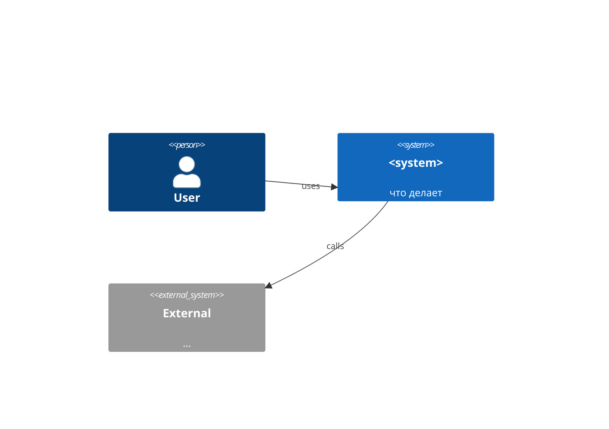
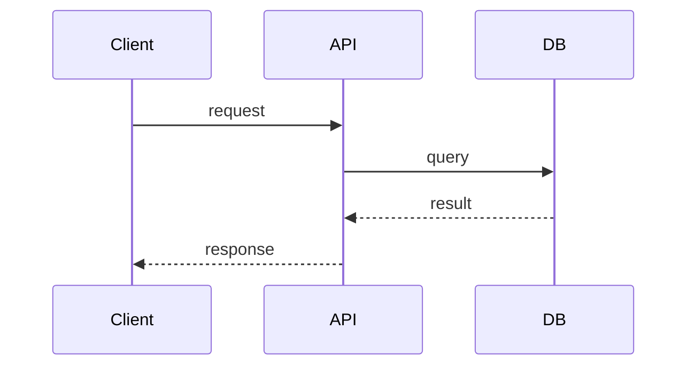

# Obsidian для разработчиков, аналитиков и архитекторов

Практический гайд по настройке Obsidian как рабочего инструмента: структура vault'а, базовые настройки, плагины по ролям, шаблоны и ежедневные ритуалы. Все рекомендации проверены на vault'ах от 500 до 10 000+ заметок.

Этот гайд — пара к [claude-code-obsidian-rag-guide.md](./claude-code-obsidian-rag-guide.md). Если планируете подключать RAG поверх vault'а, читайте сначала этот, потом RAG.

---

## Содержание

1. [Принципы — что не менять](#принципы)
2. [Базовые настройки приложения](#базовые-настройки-приложения)
3. [Структура vault'а](#структура-vaultа)
4. [Ядро плагинов — нужны всем](#ядро-плагинов--нужны-всем)
5. [Для разработчиков](#для-разработчиков)
6. [Для аналитиков](#для-аналитиков)
7. [Для архитекторов](#для-архитекторов)
8. [Шаблоны (Templater)](#шаблоны-templater)
9. [Ежедневные и еженедельные ритуалы](#ритуалы)
10. [Хоткеи, которые экономят часы](#хоткеи)
11. [Синхронизация и бэкап](#синхронизация-и-бэкап)
12. [Антипаттерны](#антипаттерны)

---

## Принципы

Перед тем как что-то ставить:

1. **Plain markdown — главная ценность.** Любой плагин, который пишет в файлы свой синтаксис, превращающий их в нечитаемые без него, — кандидат на удаление. Если завтра Obsidian умрёт, vault должен открываться в `vim`/`VS Code`/`Sublime`.
2. **Минимум плагинов.** 10–15 активных — норма, 30+ — почти всегда лишнее. Каждый плагин — это потенциальный замедлитель загрузки и риск конфликтов.
3. **Структура — на ваши задачи, не на чужой PARA.** Шаблон ниже — стартовый, через 1–2 месяца он точно поменяется.
4. **Всё в git.** Vault — текстовая папка, версионирование бесплатно и спасает.
5. **Заметки — как код.** Один источник правды, осмысленные имена, рефакторинг (= переименование/слияние) допустим.

---

## Базовые настройки приложения

### Editor

- `Default editing mode`: **Live Preview** (Source — для тех, кто пишет много кода/таблиц).
- `Strict line breaks`: **OFF** — иначе сломается совместимость с GitHub-flavored markdown.
- `Show line numbers`: ON.
- `Indent visual whitespace`: ON.

### Files & Links

- `Default location for new attachments`: **In subfolder under current folder**, имя `attachments`.
- `Use [[Wikilinks]]`: **ON** (либо OFF, если планируете публиковать в GitHub Pages — там нужен стандартный `[text](path)`).
- `New link format`: **Relative path to file** — самый предсказуемый, не ломается при перемещениях.
- `Detect all file extensions`: ON, если хотите видеть `.pdf`, `.json`, `.csv` в дереве файлов.

### Appearance

- Theme: `Minimal` или `Things` — лёгкие, без визуального шума.
- `Readable line length`: ON для длинных текстов, OFF для канбана/таблиц.
- Font: monospaced для editor, sans для preview (личный вкус).

### Hotkeys

Сразу переназначьте:

| Действие | Хоткей |
|---|---|
| Quick switcher | `Cmd+O` |
| Command palette | `Cmd+P` |
| Open graph view | `Cmd+G` |
| Toggle pinned | `Cmd+Shift+P` |
| New note in folder | `Cmd+N` |
| Daily note | `Cmd+D` |

(на macOS; на Windows/Linux — `Ctrl` вместо `Cmd`)

---

## Структура vault'а

```
MyVault/
├── 00-inbox/         # быстрая запись, недельный разбор
├── 10-projects/      # активные проекты с дедлайном
│   └── 2026-q2-platform-migration/
│       ├── README.md           # описание проекта
│       ├── decisions/          # ADR (см. ниже)
│       ├── meetings/           # заметки встреч
│       └── notes/              # рабочие черновики
├── 20-areas/         # длительные зоны: java, kafka, system-design
├── 30-resources/     # справочники, шпаргалки
│   ├── cheatsheets/
│   ├── patterns/
│   └── articles/
├── 40-archive/       # завершённое
├── 50-pdfs/          # книги, статьи в PDF
├── 60-people/        # коллеги, контакты, заметки 1:1
├── 70-daily/         # daily notes (плагин управляет)
├── 90-templates/     # шаблоны Templater
├── _meta/            # MOC (карты содержимого), индексы
│   └── HOME.md       # корневая карта
└── .obsidian/        # настройки vault'а — В GIT, чтобы шарить между машинами
```

Ключевые правила:

- **Inbox обязателен.** Без него всё валится.
- **Числовые префиксы** дают предсказуемый порядок и облегчают grep'ы.
- **Имена файлов в kebab-case** или человекочитаемо — без пробелов и спецсимволов.
- **MOC (Map Of Content)** в `_meta/HOME.md` — ваша «главная страница». Это просто markdown с группами ссылок.

Пример `_meta/HOME.md`:

```markdown
# 🏠 HOME

## Активные проекты
- [[10-projects/2026-q2-platform-migration/README]]
- [[10-projects/2026-q1-billing-rewrite/README]]

## Зоны ответственности
- [[20-areas/java/README]]
- [[20-areas/system-design/README]]
- [[20-areas/kafka/README]]

## Регулярное
- [[70-daily/2026-05-01]]
- [[20-areas/learning/weekly-review]]
```

---

## Ядро плагинов — нужны всем

Эти ставим первыми.

### 1. Templater
Полноценный шаблонизатор: динамические даты, prompt'ы при создании заметки, JS-функции.

**Зачем:** избавляет от копипаста структур заметок.

**Минимальный конфиг:** Templates folder — `90-templates/`, `Trigger Templater on new file creation` — ON.

### 2. Dataview (или Datacore — преемник)
SQL-подобные запросы по frontmatter и содержимому заметок. Превращает vault в базу данных.

**Зачем:** автогенерация списков, отчётов, дашбордов прямо в заметках.

Пример: список всех заметок с тегом `#decision` за последние 30 дней:

````markdown
```dataview
TABLE date, status
FROM #decision
WHERE date >= date(today) - dur(30 days)
SORT date DESC
```
````

### 3. Obsidian Git
Авто-коммит и пуш vault'а в git-репо. Бесплатный бэкап + история.

**Конфиг:**
- Auto backup interval: 10 минут.
- Auto pull on startup: ON.
- Commit message template: `vault: {{date}}`.

### 4. Omnisearch
Полнотекстовый поиск, который реально работает. Встроенный в Obsidian — слабее.

**Зачем:** находит даже то, что забыли отметить тегом.

### 5. Quick Switcher++
Расширяет встроенный switcher: ищет по заголовкам внутри заметок, по symbols, по recent.

### 6. Excalidraw
Свободные диаграммы: системные схемы, флоу, скетчи. Сохраняются как `.excalidraw.md` — встраиваются в обычные заметки.

**Зачем:** для архитектора и аналитика — must-have. Для разработчика — рисовать на 1:1 и в RFC.

### 7. Tag Wrangler
Управление тегами: переименование во всём vault'е, мердж, статистика.

**Зачем:** теги дрейфуют, через полгода у вас будут `#kafka`, `#Kafka` и `#kafka/streaming`. Tag Wrangler чистит.

### 8. Periodic Notes
Daily / Weekly / Monthly / Quarterly notes по шаблонам.

**Зачем:** дисциплина «писать каждый день» работает только если кнопка «открыть сегодняшний день» — одна.

### 9. Iconize (опционально, но удобно)
Иконки для папок и файлов. Делает дерево читабельнее.

---

## Для разработчиков

Что добавить поверх ядра.

### Code & Snippets

- **Advanced Slides** — превращает markdown в reveal.js-презентации. Удобно для tech talks.
- **Mermaid (встроен)** — диаграммы из текста. Учить синтаксис стоит.
- **Code Block Copy** — кнопка копирования у блоков кода.
- **Highlightr** — подсветка маркером.

### Вписать код в работу

- **Obsidian Charts** — графики из dataview-запросов.
- **Note Refactor** — выделить блок → вынести в новую заметку → оставить ссылку. Для рефакторинга больших заметок.
- **Linter** — приводит markdown к единому стилю автоматически (frontmatter, заголовки, списки).

### Шаблоны для разработчика

`90-templates/zettel.md`:

```markdown
---
id: <% tp.file.title %>
created: <% tp.date.now("YYYY-MM-DD") %>
tags: []
status: draft
sources: []
---

# <% tp.file.title %>

## Суть в одном абзаце


## Детали


## Связанные

- [[ ]]
```

`90-templates/code-snippet.md`:

```markdown
---
created: <% tp.date.now("YYYY-MM-DD") %>
language:
tags: [snippet]
---

# <% tp.file.title %>

**Когда использовать:**

**Что делает:**

```
<пасте кода сюда>
```

**Пример:**

```
<пример вызова>
```

**Подводные камни:**
```

`90-templates/adr.md` (Architecture Decision Record):

```markdown
---
id: ADR-<% tp.date.now("YYYYMMDD") %>
created: <% tp.date.now("YYYY-MM-DD") %>
status: proposed
deciders: []
tags: [decision]
---

# <% tp.file.title %>

## Контекст
<какую проблему решаем, что было до>

## Решение
<что выбрали>

## Альтернативы
1.
2.

## Последствия
- + плюсы
- − минусы / технический долг

## Ссылки
- [[ ]]
```

### Workflow разработчика

- Daily note → утром: 3 цели на день, ссылки на активные тикеты.
- На каждое непростое техническое решение — ADR в папку проекта.
- Каждое 1:1 / встреча — заметка по шаблону `meeting.md` со списком action items.
- Конспекты статей/докладов — отдельная заметка в `30-resources/articles/` со ссылкой на источник.
- Шпаргалки — в `30-resources/cheatsheets/`, одна тема — один файл.

---

## Для аналитиков

### Данные и таблицы

- **Advanced Tables** — нормальный редактор markdown-таблиц с горячими клавишами Excel.
- **CSV Editor** или **Database Folder** — открывать `.csv` прямо в Obsidian, делать запросы.
- **Dataview** (см. выше) — критичен.
- **Obsidian Charts** — линейные/столбчатые графики из dataview-данных.
- **Markmind** или **Enhanced Mindmap** — mindmap-режим для структурирования исследований.

### Шаблоны для аналитика

`90-templates/research.md`:

```markdown
---
id: <% tp.file.title %>
created: <% tp.date.now("YYYY-MM-DD") %>
status: in-progress
hypothesis:
tags: [research]
---

# <% tp.file.title %>

## Вопрос
<что именно хотим выяснить>

## Гипотеза
<что ожидаем увидеть>

## Метод
- источники данных:
- метрики:
- срез:

## Результаты

## Выводы

## Дальнейшие вопросы
- [ ]
```

`90-templates/ab-test.md`:

```markdown
---
id: AB-<% tp.date.now("YYYYMMDD") %>
created: <% tp.date.now("YYYY-MM-DD") %>
status: design
metric_primary:
mde:
sample_size:
duration_days:
tags: [ab-test]
---

# <% tp.file.title %>

## Гипотеза

## Вариант контроль / тритмент

## Метрики
- primary:
- guardrail:
- secondary:

## Расчёт мощности

## Результаты

## Решение
```

### Workflow аналитика

- Каждое исследование — папка в `10-projects/research-<id>/` со ссылками на dataset, SQL-запросы, графики.
- SQL-сниппеты — в `30-resources/sql/`. Каждый — со словесным описанием задачи и оценкой сложности/времени.
- A/B-тесты — отдельная зона `20-areas/ab-tests/` + dataview-сводка статусов в `_meta/`.

---

## Для архитекторов

### Диаграммы и схемы

- **Excalidraw** — для системных схем, sequence-диаграмм, любого whiteboarding'а.
- **Mermaid** (встроен) — для C4, sequence, ER, gantt прямо из текста, версионируется в git.
- **Canvas** (встроен) — пространственная карта связей: можно собрать «дашборд проекта» из заметок.
- **PlantUML** (через плагин) — если уже привыкли. Иначе Mermaid современнее.

Когда что:

| Что нужно | Чем рисовать |
|---|---|
| C4 на верхнем уровне (System / Container) | Mermaid C4 — текст, версионируется |
| Детальная архитектура с кастомными формами | Excalidraw |
| Sequence-диаграмма между сервисами | Mermaid sequence |
| ER-диаграмма | Mermaid ER |
| Whiteboarding обсуждения | Excalidraw → потом отрефакторить в Mermaid |
| Карта проекта (заметка-узел) | Canvas |

### Для решений

- **Kanban** — личный канбан архитектурных задач/инициатив.
- **Tasks** — `- [ ]` со сроками, dataview-агрегация по проектам.
- **Breadcrumbs** или **Juggl** — продвинутый граф для навигации между ADR и связанными решениями.

### Шаблоны для архитектора

`90-templates/c4-system.md`:

```markdown
---
id: <% tp.file.title %>
created: <% tp.date.now("YYYY-MM-DD") %>
type: c4-system
tags: [architecture, c4]
---

# <% tp.file.title %>

## Назначение системы

## Контекст (C4 Level 1)



## Контейнеры (C4 Level 2)

```mermaid
C4Container
    ...
```

## Ключевые решения
- [[ADR-... ]]

## Нерешённые вопросы
- [ ]

## Метрики и SLO
- p99 latency:
- availability:
- throughput:
```

`90-templates/sequence-diagram.md`:

```markdown
---
created: <% tp.date.now("YYYY-MM-DD") %>
tags: [sequence]
---

# <% tp.file.title %>



## Контекст

## Ошибки и таймауты

## Обратная совместимость
```

### Workflow архитектора

- Каждое значимое решение → ADR в `10-projects/<project>/decisions/`.
- Главная карта системы → `20-areas/systems/<system-name>.md` с C4 + ссылками на ADR.
- Канбан архитектурных задач — `_meta/arch-board.md` (плагин Kanban).
- Dataview-сводка по `tags: [decision]` в проекте — автоматический changelog решений.

Пример dataview для changelog:

````markdown
```dataview
TABLE status, deciders, file.cday as "Created"
FROM #decision
WHERE contains(file.path, "10-projects/2026-q2-platform-migration")
SORT file.cday DESC
```
````

---

## Шаблоны (Templater)

### Установка и базовый конфиг

1. Community Plugins → Templater → Install → Enable.
2. Settings → Templater:
   - Template folder: `90-templates`.
   - Trigger Templater on new file creation: ON.
   - Folder Templates: настройте «при создании в `10-projects/` — применить шаблон `project.md`».

### Полезные функции Templater

```javascript
<% tp.date.now("YYYY-MM-DD") %>                  // сегодня
<% tp.date.now("YYYY-MM-DD", -7) %>              // неделю назад
<% tp.file.title %>                              // имя файла без расширения
<% tp.system.prompt("Тип задачи?") %>            // спросить пользователя
<% tp.system.suggester(["bug","feature"], ["bug","feature"]) %> // выпадашка
<% tp.file.cursor() %>                           // курсор сюда после вставки
```

### Daily-шаблон (`90-templates/daily.md`)

```markdown
---
date: <% tp.date.now("YYYY-MM-DD") %>
weekday: <% tp.date.now("dddd") %>
tags: [daily]
---

# <% tp.date.now("dddd, D MMMM YYYY") %>

## 🎯 Цели на день
- [ ]
- [ ]
- [ ]

## 🗓 Встречи

## 📝 Заметки

## 🔗 Создано сегодня
```dataview
LIST
WHERE file.cday = date("<% tp.date.now("YYYY-MM-DD") %>")
SORT file.ctime ASC
```

## 🎁 Что было хорошо


## 🤔 Что улучшить

```

### Weekly review (`90-templates/weekly.md`)

```markdown
---
week: <% tp.date.now("YYYY-[W]ww") %>
tags: [weekly-review]
---

# Неделя <% tp.date.now("YYYY-[W]ww") %>

## Что закрыто
```dataview
TASK
WHERE completed AND file.mtime >= date("<% tp.date.now("YYYY-MM-DD", -7) %>")
```

## Что в работе
```dataview
TASK
WHERE !completed AND contains(text, "ACTIVE")
```

## Inbox to process
```dataview
LIST
FROM "00-inbox"
SORT file.cday ASC
```

## Решения недели
```dataview
TABLE status, deciders
FROM #decision
WHERE file.cday >= date("<% tp.date.now("YYYY-MM-DD", -7) %>")
```

## Уроки

## Фокус на следующую неделю
- [ ]
- [ ]
- [ ]
```

---

## Ритуалы

Без них vault мёртв через месяц.

### Ежедневно (5–10 минут)

- Утром: открыть daily, выписать 3 цели.
- В течение дня: всё новое — в inbox (`Cmd+N` в `00-inbox/`).
- Вечером: 5-минутный обзор — что закрыли, что переехало, что добавилось в inbox.

### Еженедельно (30 минут, обычно пятница вечер)

- Открыть weekly review.
- Разобрать `00-inbox/`: каждое — выкинуть / переместить / превратить в задачу.
- Пробежать по активным проектам, обновить статусы.
- Выбрать 1–2 фокуса на следующую неделю.

### Ежемесячно (1 час)

- Архивировать завершённые проекты в `40-archive/`.
- Обновить `_meta/HOME.md`.
- Tag Wrangler: пройтись по тегам, смержить дубликаты.
- Обзор графа (`Cmd+G`): найти заметки-сироты без ссылок.

### Раз в квартал

- Пересмотреть структуру vault'а: что не работает, что сложилось само.
- Список включённых плагинов: что не использовали — выключить.
- Бэкап всего vault'а вне облачной синхронизации (внешний диск).

---

## Хоткеи

Минимальный набор, который окупается за неделю:

| Действие | Хоткей |
|---|---|
| Quick switcher | `Cmd+O` |
| Command palette | `Cmd+P` |
| Search in vault | `Cmd+Shift+F` |
| Open graph | `Cmd+G` |
| Toggle pin | `Cmd+Shift+P` |
| Today's daily note | `Cmd+D` (через Periodic Notes) |
| New note here | `Cmd+N` |
| Insert template | `Cmd+T` |
| Toggle source/preview | `Cmd+E` |
| Insert internal link | `Cmd+K` |
| Insert callout | `Cmd+Shift+C` (через snippet/Templater) |
| Open recent | `Cmd+Shift+O` |

Дополнительно: научитесь vim-mode (если близко) — на длинных заметках реально быстрее. Settings → Editor → Vim key bindings.

---

## Синхронизация и бэкап

Три уровня:

### 1. Локальный git (бесплатно, обязательно)

```bash
cd ~/Notes/MyVault
git init
echo ".obsidian/workspace*" >> .gitignore
echo ".trash/" >> .gitignore
git add . && git commit -m "vault: initial"
```

Плагин **Obsidian Git** (см. ядро) — авто-коммиты + пуш в приватный репо на GitHub/GitLab.

### 2. Облачная синхронизация между устройствами

Варианты:

- **iCloud Drive**: бесплатно, на macOS «просто работает». Минус: иногда конфликты при правке на двух устройствах одновременно.
- **Obsidian Sync (платный)**: $4/мес, end-to-end шифрование, версионирование, мобайл. Самый надёжный.
- **Syncthing**: peer-to-peer, без облака, бесплатно. Требует настройки.
- **Dropbox/Google Drive**: работает, но больше всего конфликтов.

**Не используйте git как основной способ синхронизации** между устройствами — мержить markdown-конфликты на телефоне больно.

### 3. Холодный бэкап

Раз в месяц — `rsync` всего vault'а на внешний диск:

```bash
rsync -avh --delete ~/Notes/MyVault/ /Volumes/Backup/Vault/
```

Не забудьте зашифровать диск (FileVault).

---

## Антипаттерны

Что точно ломает vault через 3–6 месяцев:

1. **Слишком много плагинов.** Каждый — это потенциальная несовместимость и замедление. Ставьте только когда прямо чешется.
2. **Глубокая иерархия папок (5+ уровней).** Поиск становится медленным, а ссылки — нечитаемыми. Плоская структура + теги почти всегда лучше.
3. **Заметки-«монолиты» по 5 000 слов.** Делите по принципу «одна заметка — одна мысль/решение». Связи — через ссылки.
4. **Дубликаты структур.** Если у вас есть и `kafka/` папка, и тег `#kafka`, и MOC `kafka.md` — выберите одно ведущее. Я рекомендую: папка для физической группировки, теги — для cross-cutting, MOC — для навигации.
5. **Игнорирование inbox.** Без регулярного разбора inbox растёт до сотен файлов и становится свалкой.
6. **Нет шаблонов.** Каждая новая заметка с нуля → структуры разные → dataview не работает → vault превращается в хаос.
7. **Хранение секретов в vault.** Любой плагин с правом read имеет к ним доступ. Секреты — в keychain/1Password.
8. **Канбан вместо реального tracker'а.** Obsidian Kanban хорош для личных списков, но для командной работы — Jira/Linear/etc.
9. **Vault на сетевом диске.** Поиск и индексация будут адски медленными. Vault должен быть на локальном SSD.
10. **«Когда-нибудь разберусь» в `40-archive/`.** Архив — это отправлено в архив, а не «потом посмотрю». Не путайте с inbox.

---

## Минимальный стартовый набор плагинов (TL;DR)

Если не хотите ничего читать выше:

```
Templater
Dataview
Obsidian Git
Periodic Notes
Quick Switcher++
Omnisearch
Tag Wrangler
Excalidraw
Advanced Tables
Linter
```

Этого хватит на первые 3 месяца. Добавляйте остальное **по реальной потребности**, а не «на всякий случай».

---

## Что почитать дальше

- [claude-code-obsidian-rag-guide.md](./claude-code-obsidian-rag-guide.md) — RAG-обвязка поверх vault'а.
- Tiago Forte, "Building a Second Brain" — про PARA в общем виде.
- Andy Matuschak, "Evergreen notes" — про принципы атомарных связанных заметок.
- Maggie Appleton, "A Brief History & Ethos of the Digital Garden" — почему вообще такая практика.

---

## Чек-лист «Obsidian готов к работе»

- [ ] Vault лежит на локальном SSD, не на сетевом диске.
- [ ] Структура PARA + inbox + templates создана.
- [ ] `_meta/HOME.md` существует и оттуда есть ссылки на активные проекты и зоны.
- [ ] Установлены все 10 плагинов из «минимального набора».
- [ ] Templater настроен, есть шаблоны daily/weekly/zettel + ролевые (ADR / research / C4).
- [ ] Periodic Notes генерирует daily в `70-daily/` по шаблону.
- [ ] Vault под git, плагин Obsidian Git коммитит каждые 10 минут.
- [ ] Синхронизация между устройствами выбрана и настроена (iCloud/Obsidian Sync).
- [ ] Хоткеи переназначены под удобные.
- [ ] (Если применимо) RAG-обвязка из соседнего гайда поднята.
- [ ] Стоит напоминание на пятницу: 30 минут weekly review.
